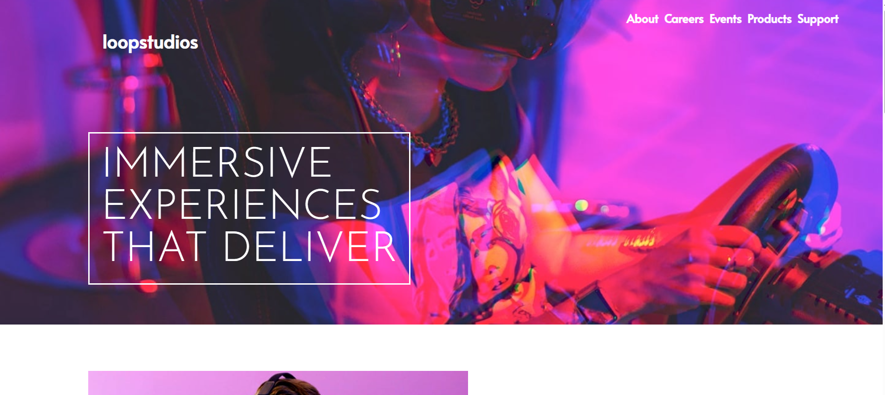

# Loopstudios Landing Page

This is a responsive landing page for **Loopstudios**, built to showcase a modern and immersive design using HTML, SCSS (SASS), and JavaScript. It's inspired by a front-end mentor challenge and focuses on layout techniques, mobile responsiveness, and clean visual hierarchy.

## 📸 Live Demo

👉 [View Live Site](https://mohamedshal.github.io/Loopstudios_LandingPage/)



## 🛠️ Technologies Used

- HTML5
- SCSS (SASS)
- Vanilla JavaScript
- Responsive Design with Flexbox & Media Queries
- Google Fonts (Josefin Sans & Alata)
- Font Awesome Icons

## 📦 Features

- Mobile menu with hamburger toggle
- Responsive grid layout
- Interactive hover effects
- Styled with SCSS for better structure and reusability

## 🚀 Getting Started

To run the project locally:

1. Clone the repository:
   ```bash
   git clone https://github.com/your-username/loopstudios-landing-page.git
